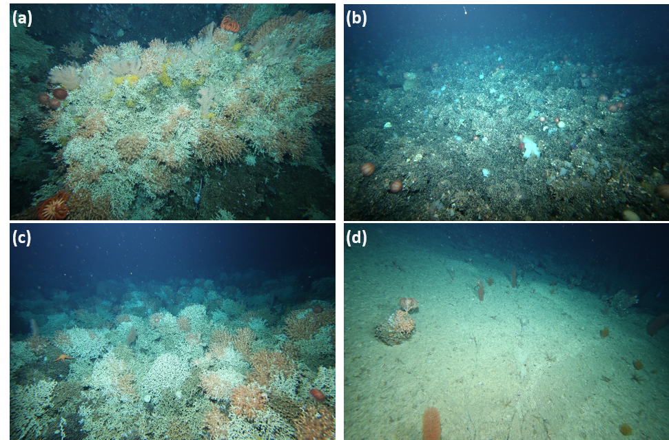

```{r setup, include=FALSE}
knitr::opts_chunk$set(echo = TRUE, message = FALSE, warning = FALSE)

library(tidyverse)
library(cowplot)
library(knitr)
```

# Background

A survey of the seamounts south of Tasmania on board of the Australian Marine National Facility Vessel Investigator imagery of the seafloor was collected on transects using a towed camera system.
The imagery consist of Video and stereo still images. The data is structured into seamounts (Map Locations), transects (operations) and images that are geolocated in space. A selection of the stereo stills are processed to generate a quadrat of measured size overlaid on the image. The area within quadrats is annotated for (1) percent cover of substrate types with the matrix-forming coral (esp. _Solenosmilia variabilis_) being of particular interest, and for (2) counts of individuals of indicator taxa for 'VME' (Vulnerable Marine Ecosystems).

{width=15cm}

# Image annotations

## 1. Percent cover annotations

Percent cover of substrate types is annotated using a point count approach in TransectMeasure software from [SEAGIS](https://www.seagis.com.au/). Random points at a density of 5 points.m^-2^) were thrown into the measured quadrat and annotated for 16 categories, including 3 matrix-forming coral species distinguished into live vs. dead, 4 other biogenic substrates, 5 non-biogenic substrate types and a not-scorable' category where no category could be assigned due to image limitation or obstruction by mobile fauna. The CATAMI classification ([Althaus et al. 2015](https://journals.plos.org/plosone/article?id=10.1371/journal.pone.0141039)) was used to define the substrate categories. Descriptive codes were used for each category for ease of data manipulation.In addition to the annotations of the random points an overall classification of the whole quadrat was applied to capture the overall impression, especially with regard to potential past fishing impact.

Codes and descriptions of the point categories used: 

* SC-ENLP: Cnidaria - Stony corals - Enalopsammia (live)
* SC-SOL: Cnidaria - Stony corals - Solenosmilia (live)
* SC-MAD: Cnidaria - Stony corals - Madrepora (live)
* SU-ENLP: Cnidaria - Stony corals - Enalopsammia (dead)
* SU-SOL: Cnidaria - Stony corals - Solenosmilia (dead)
* SU-MAD: Cnidaria - Stony corals - Madrepora (dead)
* SU-BCOR: Unconsolidate - Biogenic - Coral Rubble 
* SU-BBAR: Unconsolidate - Biogenic - Barnacle plates
* SU-BOTH: Unconsolidate - Biogenic - other
* SU-CONBIO: Consolidate - Biogenic - other (note this substrate types was not consistentlly recorded combine with xxx)
* SU-ROK: Consolidate - Rock
* SU-BOL: Consolidate - Boulder
* SU-COB: Consolidate - Cobbles
* SU-PEBGRAV: Unconsolidate - Pebble - gravel
* SU-SAMU: Unconsolidate - Sand/mud
* NS: Unscorable

## 2. VME taxa counts

Counts of indicator taxa for vulnerable marine ecosystems (VME) are made within each quadrat, allowing for calculating standardised densities per square metre. In addition, by-eye estimated of the percent cover of coral matrix (dead & alive combined) are recorded for the three types of matrix forming coral distinguished for percent cover annotations, in order to compare percent cover from point counts and estimates. Annotations are made in the CSIRO insidence of the MBARI developed Video Annotation and Registration System ([VARS](http://vars.it.csiro.au/)). The VME taxa targetted are listed below. Again, the CATAMI classification ([Althaus et al. 2015](https://journals.plos.org/plosone/article?id=10.1371/journal.pone.0141039)) was used to classify the taxa. The comments field in VARS is used to record counts and to record additional modifyiers such as colour of distinctive taxa within some of the VME taxon groups (e.g. yellow and brown stalked crinoids were distinguished). An additional category of 'No-VMEfauna' was added to indicate that an image was annotated but none of the taxa of interest were observed. 

VME taxa targetted:

* Sponges
* Stony corals: Branching: _S.variabilis_
* Stony corals: Branching: _Enalopsammia_
* Stony corals: Branching: _Madrepora_
* stony corals (other)
* Black & Octocorals
* Stalked crinoids
* Unstalked crinoid
* Brisingid
* True Anemones: Fourlobed
* Hydrocorals: Branching
* Hydrocorals (presence only recorded)

Additional taxa of interest:

* Regular urchins
* _Dermechinus horridus_ (a regular urchin)
* Irregular urchins

Percent cover of matrix forming coral (dead & alive), by-eye estimate:

* PC_Sub_CoralReef:  Coral reef species undetermined
* PC_Cub_EnallopMatrix: _Enallopsammia_ matrix
* PC_Sub_SolMatrix: _Solenosmilia_ matrix


# Data preparation and cleaning

## 1. Percent cover data

The TM raw output data set is a concatenation of all TM project outputs. Each of the output files consist of the point annotations within images and the 'user defined' point annotation for the entire image. The raw data extract is tidied up using the separate R script **Tidy_TM_Concat_data.R**. This separates the raw data into overview annotations and point annotations and transformed into percent cover by substrate category for each image. Then the latter are linked to image geolocation information and written out to .cvs as column-format data (PCcover.csv) and as matrix format (PCcoverbyImage.csv), for use in further analyses and for mapping in QGIS.

Note, at this stage the overview annotations were separated out from percent cover data but are not furher cleand or considered.

## 2. VME taxa counts

The VME taxon counts are extracted from the VARS Oracle data base using the script **VARS_2018-StillsAnnoExtracts.sql**. The raw data extract is tidied up using the separate R script **VME_anno_tidy.R**. The non-numrical comments are separated from the counts and percent covers; these are currently not further used. The numeric data is split into percent cover data and the counts. The latter are linked to the quadrat sizes and converted to densities (ind.m^-2^). each of the tables is linked to image geolocation information and written out to .cvs as column-format data (VMEanno_PCcoral.csv and VMEanno_DensQ.csv) and combined as matrix format (VMEannoMatrix.csv), for use in further analyses and for mapping in QGIS.

Note, at this stage the modifyiers (colour, etc) are not incorporated into the output data.
    
# Data exploration

Inital data summaries and plots based on the by image operations details and the five .csv files written out by the data cleaning process. 

```{r data loading}
# read all stills data and make depth numeric

AllSTills <- read_csv("data/IN2018_V06_AllStills.csv") %>% 
  mutate(depth=as.numeric(Z)) %>% 
  select(-c(Z))

PCcoverbyImage <- read_csv("Results/PCcoverbyImage.csv")
PC_cover <- read_csv("Results/PCcover.csv")

VMEanno_DensQ <- read_csv("Results/VMEanno_DensQ.csv")
VMEanno_PCcoral <- read_csv("Results/VMEanno_PCcoral.csv")
VMEannoMatrix <- read_csv("Results/VMEannoMatrix.csv")


# summary not presented in Table but handy to have code identifying all images selected together with selection number
SelectedStlls <- AllSTills %>% 
  filter(`Selection round (1 orig sel, 2 replacement)` == 1 |
           `Selection round (1 orig sel, 2 replacement)` == 2 |
           `Selection round (1 orig sel, 2 replacement)` == 3) 

replaced <- SelectedStlls %>% 
  filter(RAN_SEL_STAT == "R")

NSNR <-  SelectedStlls %>% 
  filter(RAN_SEL_STAT == "NS-NR") 

TargetQuads <-SelectedStlls %>% 
  filter(RAN_SEL_STAT != "R") 

```

In total `r nrow(TargetQuads)` images were potentially targeted for annotation, of these `r nrow(PCcoverbyImage)` have been annotated for percent cover of substrate types, `r nrow(VMEannoMatrix)` have been annotated for VME taxa and `r nrow(NSNR)` were identified as unsuitable for annotation and could not be replaced; in total `r nrow(replaced)` of the original selected images were replaced through our 'gapfilling' protocol. Summary of the number of images targeted for stills analyses and the number of images annotated for percent cover and for VME taxa. (NOTE need to exclude operations that were not targeted from this summary)

```{r TbTRansects, tab.cap ="Overviw of tansects with annotations"}

PC_done <- PCcoverbyImage %>% 
  group_by(SVY_OPS) %>% 
  summarise(PCdone=n())

VME_done <- VMEannoMatrix %>% 
  group_by(SVY_OPS) %>% 
  summarise(VMEdone=n())

NSNR_ops <-  NSNR %>% 
  group_by(SVY_OPS) %>% 
  summarise(NR= n())

## NOTE will need to limit the data here to target ops only
Target <- AllSTills %>% 
  group_by(SVY_OPS, MapLoc, `Target RANSMPL (1/10)`) %>% 
  filter(`Selection round (1 orig sel, 2 replacement)` == 1 |
           `Selection round (1 orig sel, 2 replacement)` == 2 |
           `Selection round (1 orig sel, 2 replacement)` == 3) %>%
  filter(RAN_SEL_STAT != "R") %>% 
  summarise(Selected = n()) %>% 
  left_join(PC_done, by=c("SVY_OPS"="SVY_OPS")) %>% 
  left_join(VME_done, by=c("SVY_OPS"="SVY_OPS")) %>%
  left_join(NSNR_ops, by=c("SVY_OPS"="SVY_OPS"))


#tried to call this in text xxx with `r view(nTarget)` but doesn't work

kable(Target[1:7], caption="By operation processing summary")

```
The depth distribution of the data set 

```{r FigDAtadpth, fig.cap = "depth distribution of the annotated imagery"}

PCcoverbyImage %>% 
  ggplot(aes(x = depth)) +
  facet_wrap(~ MapLoc) +
  geom_histogram(bins=10)

```


## 1. Percent cover

In total there are `r nrow(PCcoverbyImage)` randomly selected images have been annotated for percent cover to date. In total `r nrow(PC_done)` operations have been (at least partially) annotated.  

Below is a summary of the data distribution across the targeted substrate types

```{r TbPCcoversummary, tab.cap ="Overviw of substrate scores" }

# check out the substrate codes that were annotated

PCsum <- PC_cover %>% 
  group_by(L2_Code) %>% 
  summarise(meanPCcover= mean(PC_cover), PresNo_Images = n())

kable(PCsum [1:3], caption="Summary of the data distribution across the targeted substrate types")

```

The depth distribution of the live and dead coral matrix are of particular interest in looking at the depth distribution of the substrate types. 

```{r FigSubstDpth, fig.height= 8, fig.width=10, fig.align='center', fig.cap="Depth distribution of substrate types summary graph"}
#distribution of the substrate types
# create a vector with the sequence of the substrate types for ordering them in a meaningful way
SubstSeq <- c('SC-ENLP',
              'SU-ENLP',
              'SC-SOL',
              'SU-SOL',
              'SC-MAD',
              'SU-MAD',
              'SU-BCOR',
              'SU-BBAR',
              'SU-BOTH',
              'SU-ROK',
              'SU-BOL',
              'SU-COB',
              'SU-CONBIO',
              'SU-PEBGRAV',
              'SU-SAMU',
              'NS')
# create a unique colour scheme for substrate types
SubstCol <- c('SC-ENLP' = "yellow",
              'SU-ENLP'= "yellow3",
              'SC-SOL'= "deeppink",
              'SU-SOL'="hotpink1",
              'SC-MAD'= "darkorchid1",
              'SU-MAD' = "darkorchid4",
              'SU-BCOR' = "orange",
              'SU-BBAR' = "orange3",
              'SU-BOTH' = "orange4",
              'SU-ROK' = "blue",
              'SU-BOL' = "dodgerblue",
              'SU-COB' = "dodgerblue3",
              'SU-CONBIO' = "cyan3",
              'SU-PEBGRAV'= "cyan",
              'SU-SAMU' = "palegreen",
              'NS' = "black")
ggplot(PC_cover,
       mapping= aes(x=factor(L2_Code, level =SubstSeq),              #call the pre existing vector
                    y=depth,
                    size=PC_cover,
                    colour=L2_Code)
  )+
  geom_point(alpha=0.2)+
  scale_y_reverse() +                            # reverse y-axis because it represents ocean depth 
  theme(axis.text.x = element_text(angle = 90))+   # rotate the label on x-axis
  labs(x="substrate type", y="depth")+
  scale_colour_manual(values=SubstCol)+
  theme(legend.text = element_text (size=7))+
  theme(legend.position = 'bottom')

```

Coral rubble appears to have quite a high concentratio in the shallowest depths, scattering the raw data may make this easier to see:

```{r FigPCSMsuDist, out.width='100%', fig.align='center', fig.cap="Depth distribution of substrate types"}
PC_cover %>% 
  ggplot(aes(x = depth,
             y = PC_cover))+
  geom_point(alpha=0.2)+
  facet_wrap(~L2_Code)

```


Distribution of the substrate types by selected locations - here the seamounts from the recovery time series are selected. 

```{r FigPCpies1, eval=TRUE, out.width='100%', fig.height= 20, fig.width=10, fig.cap="Pie charts of substrate distribution by locations, using the colour scheme identified above"}
# currentl the pie graphs are not run for the knittin...
PC_cover %>% 
  group_by(MapLoc, L2_Code) %>% 
  summarise(totPC = sum(PC_cover)) %>% 
  ungroup() %>% 
  group_by(MapLoc) %>% 
  mutate(PCPC = (100*totPC/sum(totPC))) %>% 
  ggplot(
       mapping= aes(x="", 
                    y=PCPC,               
                    fill=factor(L2_Code, level =SubstSeq)
       ))+
    geom_bar(stat="identity", width=1)+
    coord_polar("y", start=0)+
  scale_fill_manual(values=SubstCol)+
  theme(legend.position = 'bottom')+
  facet_wrap(~MapLoc, ncol = 5)

```

Figure 2 above shows a relatively narrow depth band where _Solenosmilia_ (particulaly live coral) is observed, and a surprisingly high contribution of coral rubble in the shallowest images. Looking at the distribution of coral matrix formed by _Solenosmilia_ (SC_SOL and SU_SOL) and coral rubble (SU_BCOR) in more detail, particularly by depth and location. 

```{r FigSVhist, out.width='100%', fig.align='center', fig.cap="Frequency distrbution histograms of % cover recorded for coral matrix and rubble"}
CoralPC <- PC_cover %>% 
  filter(L2_Code == "SC-SOL" |
         L2_Code == "SU-SOL" |
        L2_Code == "SU-BCOR"  )

CoralPC %>% 
  ggplot(aes(x = PC_cover)) +
  facet_wrap(~ L2_Code) +
  geom_histogram()

```

Just concentrating on the Coral rubble, why is there a high proportion of rubble in shallow sites

```{r FigRubChecks, out.width='100%', fig.align='center', fig.cap="Distribution of coral rubble by seamount location"}
PC_cover %>% 
  filter(L2_Code == "SU-BCOR") %>% 
  ggplot(aes(x = depth,
             y = PC_cover))+
  geom_point(alpha=0.2)+
  facet_wrap(~MapLoc)


```

## 2. VME taxa

In total there are `r nrow(VMEannoMatrix)` randomly selected images have been annotated for the density of VME taxa to date. In total `r nrow(VME_done)` operations have been (at least partially) annotated. 

```{r, FigPCExp,  fig.cap="*Frequency distribution of a) total density of VME data and b) total number of taxa "}
# looking at the distribution of density and number of taxa over the whole data set
VME_TotDens <- VMEanno_DensQ %>% 
  filter(CONCEPT != "No-VMEfauna") %>% 
  group_by(image_key, SVY_OPS, MapLoc, depth) %>% 
  summarise(TotDens=sum(Dens),
            noTaxa=sum(NoTypes)) 

TotVME_dens <- VME_TotDens %>% 
  ggplot(aes(x=TotDens))+
  geom_histogram()

# number of Taxa 
TotVMEtax <- VME_TotDens %>% 
  ggplot(aes(x=noTaxa))+
  geom_histogram()  

# combine plots into a 2 panel figure
plot_grid(TotVMEtax, TotVME_dens) 


```

Instead of total density only use the totals for actual VME taxa (excluding urchins,)

```{r, FigDensEx,  fig.cap="**Frequency distribution of total density of VME taxa only "}
# looking at the distribution of density and number of taxa over the whole data set
VMEonly_TotDens <- VMEanno_DensQ %>% 
  filter( CONCEPT == "Black & Octocorals" |
                  CONCEPT == "Brisingid"  |
                  #CONCEPT == "D.horridus",
                  CONCEPT == "Enallopsammia"  |
                  #CONCEPT == "Hydrocorals"  |
                  CONCEPT == "Hydrocorals: Branching"  |
                  #CONCEPT == "Irregular urchins"  |
                  CONCEPT == "Madrepora"  |
                  #CONCEPT == "No-VMEfauna",
                  #CONCEPT == "Regular urchins"  |
                  CONCEPT == "S.variabilis"  |
                  CONCEPT == "Sponges"  |
                  CONCEPT == "Stalked crinoids"  |
                  CONCEPT == "Stony corals",
                  #CONCEPT == "True anemones: Fourlobed"  |
                  #CONCEPT == "Unstalked crinoids"
          )%>% 
  group_by(image_key, SVY_OPS, MapLoc, depth) %>% 
  summarise(VMEtaxaDens=sum(Dens))

VMEonly_TotDens %>% 
  ggplot(aes(x = VMEtaxaDens))+
  geom_histogram()


```

## Combined substrate and VME taxa data

Combining the totals of the VME taxa annotations with the percent cover annotations allows us to examine correlations between Total VME fauna density and substrate types. 

```{r Combine_Anno, echo=TRUE}

# excluded for now 
# looking at some summary stats

#temporary table: add summary of total density, number of taxa and tot density VME taxa to densities of separated VME taxa
  
 TVME <- VMEannoMatrix %>% 
  select(image_key,
         `Black & Octocorals`,
         `Brisingid`,
         `D.horridus`,
         `Enallopsammia`,
         `Hydrocorals`,
         `Hydrocorals: Branching`,
         `Irregular urchins`,
         `Madrepora`,
         `No-VMEfauna`,
         `Regular urchins`,
         `S.variabilis`,
         `Sponges`,
         `Stalked crinoids`,
         `Stony corals`,
         `True anemones: Fourlobed`,
         `Unstalked crinoids`,
         PC_Sub_CoralReef,
         PC_EnallopMatrix,
         PC_SolMatrix) %>% 
  left_join(VMEonly_TotDens, by=c("image_key"="image_key")) %>% 
  left_join(VME_TotDens, by=c("image_key"="image_key")) %>% 
  select(-MapLoc.y, -depth.y, -SVY_OPS.y)


# select out the Percent cover values from PC_Matrix and add this to the table above

VME_AnnoAll <- PCcoverbyImage %>% 
  select(image_key,
         'SC-ENLP',
         'SU-ENLP',
         'SC-SOL',
         'SU-SOL',
         'SC-MAD',
         'SU-MAD',
         'SU-BCOR',
         'SU-BBAR',
         'SU-BOTH',
         'SU-ROK',
         'SU-BOL',
         'SU-COB',
         'SU-CONBIO',
         'SU-PEBGRAV',
         'SU-SAMU',
         'NS') %>% 
  left_join(TVME, by=c("image_key"="image_key"))

#Reading out the data table is commented out
#kable(VME_AnnoAll [1:42], caption="**Table 3** Combined data matrix (by image) of percent substrate types and VME taxon densities, including the summaries of densities")


```

Checking how well the estimated percent cover of coral matrix matches with  measured percent cover of coral matrix (dead & alive) 

```{r FigPCcoverComparison, out.width='100%', fig.align='center', fig.cap="Comparison of estimated and measured percent cover of Solenosmilia matrix"}

VME_AnnoAll %>% 
  ggplot(mapping = aes(x= (`SC-SOL`+`SU-SOL`), 
                     y= PC_SolMatrix))+
   geom_point()

estVmeas_lm <- lm(PC_SolMatrix ~ (`SC-SOL`+`SU-SOL`), data = VME_AnnoAll)

estVmeas_lm
```


```{r FigPCcoverAllreef, out.width='100%', fig.align='center', fig.cap="Comparison of estimated and measured percent cover of all types of coral matrix"}

VME_AnnoAll %>% 
  ggplot(mapping = aes(x= (`SC-SOL`+`SU-SOL`+ `SC-ENLP`+ `SU-ENLP`+ `SC-MAD` + `SU-MAD`), 
                     y= (`PC_SolMatrix` + `PC_Sub_CoralReef` + `PC_EnallopMatrix`)))+
   geom_point()


```

checking out the distribution of VME taxa over coral matrix substrates.

```{r MyFig4, fig.align='center', fig.height= 4, fig.width=10,  fig.cap="Relationship between density of VME taxa and percent cover of matrix forming coral"}
VMEanno_DensQ %>% 
  left_join(PCcoverbyImage, by=c("image_key"="image_key")) %>% 
  filter((`SC-SOL`+`SU-SOL`) != 0) %>% 
    ggplot(mapping = aes(x= (`SC-SOL`+`SU-SOL`), 
                     y= Dens
                     ))+
   geom_point()+
  labs(x="% cover coral matrix (dead and alive)", y="density of VME taxa (ind./m2)")+
  facet_wrap(~CONCEPT, scales = "free_y")
```


## Impacts - overview dta from PC cover analyses

Looking into the overview scores of potential gear impacts for still images 

```{r TbImpOv, tab.cap ="Overviw scores grouped by impact classes"} 

# data exploration for overview scoring
OvCat<- PCcoverbyImage %>% 
  group_by(OV_CAT, ImpGroup, ImpClass) %>% 
  summarise(cntRec = n()) %>% 
  arrange(ImpClass)

 kable(OvCat, caption="overview categories scored")
```

```{r FigImpactdata, eval = FALSE, out.width='100%', fig.align='center', fig.cap="Impact overview evaluation"}
PCcoverbyImage %>% 
  ggplot(aes(x = depth,
             y = `SU-BCOR`,
             colour = ImpClass))+
  geom_point(alpha=0.2)+
  facet_wrap(~MapLoc)

PCcoverbyImage %>% 
  ggplot(aes(x = depth,
             y = (`SU-SOL`+ `SC-SOL`),
             colour = ImpClass))+
  geom_point(alpha=0.2)+
  facet_wrap(~MapLoc)

PC_cover %>% 
   group_by(L2_Code) %>% 
   ggplot(aes(x = ImpClass,
              y = mean(PC_cover),
              fill = L2_Code)) +
     geom_col() +
   theme(axis.text.x.bottom = element_text(angle = 90))

PCcoverbyImage %>% 
  ggplot(aes(x = depth,
             y = (`SU-SOL`+ `SC-SOL`+`SU-BCOR`),
             colour = ImpClass))+
  geom_point(alpha=0.2)+
  facet_wrap(~MapLoc) 

```

Looking at the distribution of the overview categories by seamount will help to identify locations for further scrutiny:

```{r FigSMImpact, out.width='100%', fig.align='center', fig.cap="Overview of impact scores over depth for each seamount"}

colpal <-  c("grey",
            "blue",
             "cyan",
             "purple",
             "Orchid",
             "green",
             "orange",
             "red",
             "brown",
             "black")
ggplot(PC_cover,
       mapping = aes(x=factor(ImpClass),              #call the pre existing vector
                    y=depth,
                    colour = factor(ImpGroup)))+
  geom_point(alpha=0.2)+
  scale_y_reverse() +                            # reverse y-axis because it represents ocean depth 
  theme(axis.text.x = element_text(angle = 90))+   # rotate the label on x-axis
  scale_color_manual(values = colpal)+
  labs(x="Impactclass", y="depth")+
  facet_wrap(~MapLoc)


```